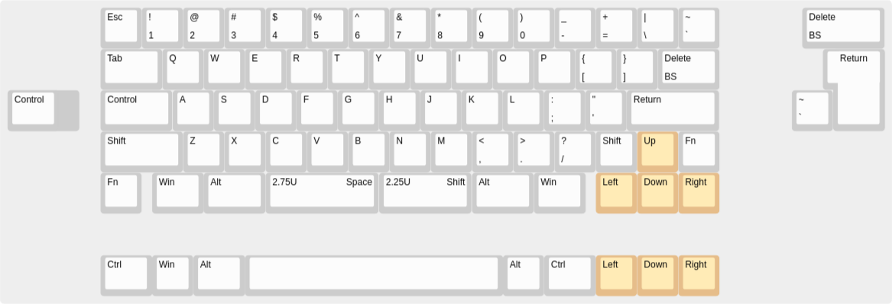

# Project Wada

Although I love my HHKB Pro 2, sometimes I just want some arrow keys for gaming. This made me learn how to design a PCB and make it has a layout somewhat similar to the HHKB. I also realized that the Realforce RC1 kinda has the same layout as this keyboard too.

Anyways, here is the layout.

## Incomplete..... more to come after I finished!
